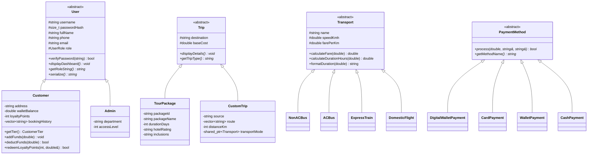

# 🇧🇩 Bangladesh Tourism & Travel Management System (OOP Project)

An advanced, production-grade **Object-Oriented Programming (OOP)** and **Data Structures** project in C++ (C++14/C++17) designed for university-level OOP coursework (e.g., CSE 1.2 / CSE 2.1).

---

## 🌟 Key Highlights & Core Features

### 1. 🏛️ Robust Object-Oriented Architecture (SOLID Principles)
- **Inheritance & Abstract Base Classes (ABCs)**:
  - `User` (Abstract Base Class) $\to$ `Customer` and `Admin`.
  - `Trip` (Abstract Base Class) $\to$ `TourPackage` (curated holidays) and `CustomTrip` (dynamic Dijkstra routing).
  - `Transport` (Abstract Base Class) $\to$ `NonACBus`, `ACBus`, `ExpressTrain`, `DomesticFlight`.
  - `PaymentMethod` (Abstract Strategy Interface) $\to$ `DigitalWalletPayment` (bKash/Nagad), `CardPayment`, `WalletPayment`, `CashPayment`.
- **Dynamic Polymorphism**:
  - Virtual functions and virtual destructors across all base classes (`calculateFare()`, `formatDuration()`, `displayDashboard()`, `process()`).
  - Polymorphic smart pointer containers (`std::shared_ptr<User>`, `std::shared_ptr<Transport>`, `std::shared_ptr<PaymentMethod>`).
- **Encapsulation & Data Hiding**:
  - Validated accessors/mutators, invariant protection, salted password hashing.
- **Operator Overloading**:
  - Stream insertion `operator<<` for printing formatted bookings and summaries.
  - Relational `operator<` for sorting tour packages by budget.

### 2. 🌐 Modern Interactive Web Interface (Single Page App)
- **Interactive Bangladesh SVG Map with Live Dijkstra Visualizer**: Select origin and destination to see the glowing shortest path animated directly on the map.
- **Tour Packages Showcase**: Destination cards with duration, hotel ratings, and 1-click booking.
- **Simulated Payment Gateways**: bKash modal, Nagad modal, Visa/Mastercard checkout, and in-app Wallet.
- **Digital Boarding Pass Generator**: Print-ready boarding ticket with barcodes and itemized invoices.
- **Customer & Admin Dashboards**: Complete with Chart.js analytics graphs, wallet management, loyalty point redemption, and route manager.
- **1-Click Run**: Double-click `open_web.bat` or open `web/index.html` in any browser!

### 2. 🗺️ Graph Theory & Dijkstra's Algorithm (Path Reconstruction)
- **Highway Network of Bangladesh**:
  - Pre-seeded with 21 major districts (Dhaka, Chittagong, Cox's Bazar, Sylhet, Khulna, Rajshahi, Rangpur, Barisal, Comilla, etc.) and realistic highway road distances.
- **Dijkstra Shortest Path with Full Path Reconstruction**:
  - Min-priority queue based Dijkstra shortest path algorithm.
  - Reconstructs exact sequence of intermediate nodes (e.g. `Dhaka ===> Tangail ===> Bogra ===> Dinajpur`).
  - Automatically calculates distance, duration, and fare across 4 vehicle classes.

### 3. 💳 Strategy Pattern & Dynamic Pricing
- **Payment Processing**:
  - Digital Wallets (`bKash`, `Nagad` with masked PIN simulation).
  - Visa / MasterCard Credit/Debit cards (with masked 16-digit card input).
  - Customer in-app Travel Wallet with top-up and instant checkout.
- **Discounts & Loyalty Engine**:
  - Tier-based member discounts (`Silver`, `Gold` [5% off], `Platinum` [10% off]).
  - Promotional Coupon Codes (e.g. `OOP100` for 1000 BDT off, `HOLIDAY20` for 20% off, `BANGLADESH` for 15% off).
  - Loyalty points system (earn points on every trip, redeem 1 pt = 0.50 BDT cash back into wallet).
  - Government VAT (5%) breakdown on every booking.

### 4. 🖨️ Boarding Pass & Invoice Generation
- Generates ASCII boarding passes on screen and automatically exports printable text invoice files (`receipts/TICKET_BK-YYYY-XXXX.txt`).

### 5. 💾 Full Data Persistence
- Automatically seeds and persists all records in clean text files inside `data/`:
  - `data/locations.txt`: Dynamic highway route network.
  - `data/packages.txt`: Published tour package catalog.
  - `data/users.txt`: Encrypted user credentials and customer balances.
  - `data/bookings.txt`: Master booking history and statuses.
  - `data/coupons.txt`: Active promotional voucher codes.

### 6. 🎨 Modern Stylized Console UI / UX
- ANSI-colored borders, tables, cards, and header banners.
- Masked password input (replaces characters with `*`).
- Bulletproof input validators (preventing cin stream corruption or infinite loops on invalid input).

---

## 📂 Project Structure

```
Travel-Management-system-main/
│
├── include/                     # Modular Header Files
│   ├── core/
│   │   ├── Exceptions.h         # Domain Exception Hierarchy
│   │   ├── Graph.h              # Graph & Dijkstra Data Structures
│   │   └── Utils.h              # ANSI Colors, Hashing, Time, Masked Password
│   ├── models/
│   │   ├── Booking.h            # Booking Model & Boarding Pass Exporter
│   │   ├── Payment.h            # Strategy Pattern Payment Hierarchies
│   │   ├── Transport.h          # Transport Modes (Bus, Train, Flight)
│   │   ├── Trip.h               # Trip ABC, TourPackage, CustomTrip
│   │   └── User.h               # User ABC, Customer (Loyalty/Wallet), Admin
│   ├── services/
│   │   ├── AuthService.h        # Authentication & Customer Registration
│   │   ├── BookingService.h     # Trip Booking, Pricing & Refund Logic
│   │   └── FileManager.h        # Persistence & Default Data Seeding
│   └── ui/
│       └── ConsoleUI.h          # Menu Renderer & Input Validators
│
├── src/                         # Modular Implementation Files
│   ├── core/
│   │   └── Graph.cpp
│   ├── models/
│   │   ├── Booking.cpp
│   │   ├── Trip.cpp
│   │   └── User.cpp
│   ├── services/
│   │   ├── AuthService.cpp
│   │   ├── BookingService.cpp
│   │   └── FileManager.cpp
│   └── ui/
│       └── ConsoleUI.cpp
│
├── data/                        # Persistent Storage
│   ├── bookings.txt
│   ├── coupons.txt
│   ├── locations.txt
│   ├── packages.txt
│   └── users.txt
│
├── receipts/                    # Generated Boarding Tickets / Invoices
│   └── TICKET_BK-2026-1001.txt
│
├── main.cpp                     # Modular Entry Point
├── TravelManagementSystem_standalone.cpp  # Single-file All-in-One Build
├── build.bat                    # One-Click Windows Build Script
├── CMakeLists.txt               # CMake Build Configuration
└── README.md                    # Project Documentation
```

---

## 🔑 Default Login Credentials

| Role | Username | Password | Notes |
| :--- | :--- | :--- | :--- |
| **Administrator** | `admin` | `admin123` | Full access to route graph, packages, analytics, & coupons |
| **Customer (Demo)** | `rahman` | `pass123` | Pre-loaded with 25,000 BDT wallet balance & Gold tier |
| **New Customer** | *(Register)* | *(Your Pass)* | Comes with 500 BDT welcome bonus & 50 loyalty points |

---

## 🎟️ Active Promotional Promo Codes

| Promo Code | Discount Type | Description |
| :--- | :--- | :--- |
| `OOP100` | Flat 1,000 BDT Off | Special university coursework coupon |
| `HOLIDAY20` | 20% Percentage Off | Seasonal vacation discount |
| `BANGLADESH` | 15% Percentage Off | National tourism offer |
| `WELCOME50` | Flat 500 BDT Off | New customer welcome voucher |

---

## 🚀 How to Build and Run

### Method 1: Using the One-Click Batch Script (Windows)
Double-click or run:
```cmd
build.bat
```

### Method 2: Compile with MinGW GCC / G++ (Command Line)
**Standalone Single-File:**
```bash
g++ -std=c++14 -O2 TravelManagementSystem_standalone.cpp -o TravelManagementSystem.exe
./TravelManagementSystem.exe
```

**Modular Multi-File:**
```bash
g++ -std=c++14 -O2 -I. main.cpp src/core/*.cpp src/models/*.cpp src/services/*.cpp src/ui/*.cpp -o TravelManagementSystem_modular.exe
./TravelManagementSystem_modular.exe
```

### Method 3: Using CMake
```bash
mkdir build && cd build
cmake ..
cmake --build .
```

### Method 4: In Code::Blocks / Dev-C++ / Visual Studio
Simply create a new Console Application project and add `TravelManagementSystem_standalone.cpp` (or all files in `include/` and `src/`), then click **Build & Run** (`F9` / `Ctrl+F5`).

---

## 📊 Class Diagram (Mermaid)



---

## 🎓 Academic Contribution
This project showcases mastery over:
- Advanced C++ Object-Oriented Design (Encapsulation, Polymorphism, Abstraction, Inheritance)
- Design Patterns (Strategy Pattern, Factory Method, DAO/Repository Persistence)
- Graph Algorithms (Dijkstra's Shortest Path Algorithm on Weighted Graphs)
- Stream File I/O & Serialization
- Exception Handling
- Robust UX Design with ANSI Terminal Styling
